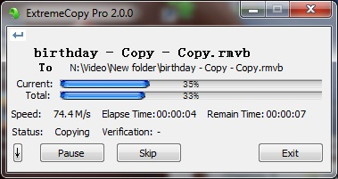

# ExtremeCopy

ExtremeCopy is a Windows utility which copy and move files extremely fast, it will auto optimize speed and resources base on target physical machine.

**ExtremeCopy includes the following features:**

   * Copy or move files or folders with extremely fast.
   * Increase the file copying speed up to 20% to 120% in comparison the default Windows copying function.
   * Save much time when backup huge files to another hard drive or USB drive.
   * Easily manage copying task.
   * Able to calculate and display remain time exactly.
   * Supports Break Point which able to pause when encounters any problems such as file being locked and resume back with click on "Continue" button once the problem fixed.
   * Supports multiple languages.

**Site**: [http://www.easersoft.com](http://www.easersoft.com)

For high performance purpose, all of code are written in C++ and using Win32 API directly.

ExtremeCopy uses email as bug report deliver to send dump file send to itself, setup your email account in **BugReport.cpp** if you want to use it.

For legacy paid version, there is **RegisterCodeGenerator** project can generate register code for it.

欢迎加入 ExtremeCopy 用户交流QQ群： 793476374
